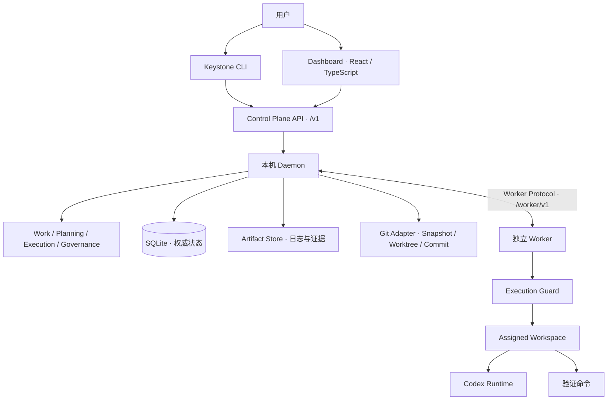

# Keystone

Keystone 是一个本地优先的 AI 软件开发控制平台：把自然语言需求组织成可追踪的 Change，经过理解、设计、规划和任务拆分，再在隔离的 Git Worktree 中调用 AI 编码工具，收集执行证据、运行验证并生成受控提交。

它面向希望在本机管理多个 Git 项目、保留 AI 工作过程、通过明确状态和人工决定控制开发流程的用户。CLI 与 Dashboard 提供操作和观察入口，后台 Daemon 管理持久状态，独立 Worker 调用编码 harness 和验证工具。

> 当前处于 V1 开发阶段。仓库已有 Planning、Ticket Graph、Execute、Verify/Commit/FinalVerify 和 Dashboard 实现，但真实 Codex、原生 Windows 及完整端到端验收证据仍有缺口。以下说明基于当前源码；“已有实现”不等于完整生产验收通过。

## 目录

- [功能与边界](#功能与边界)
- [项目架构](#项目架构)
- [Harness 接入](#harness-接入)
- [安装与启动](#安装与启动)
- [使用流程](#使用流程)
- [Dashboard](#dashboard)
- [本地数据](#本地数据)
- [常见问题](#常见问题)
- [开发与文档导航](#开发与文档导航)

## 功能与边界

| 能力 | 当前实现及使用边界 |
| --- | --- |
| 项目注册 | 识别 Git Repository，生成 `.keystone/project.yaml`，建立 Project 与仓库路径的绑定 |
| Change 管理 | 保存需求原文、固定 BaseRevision，支持查询、暂停、恢复、取消和人工重试/取消决定 |
| AI Planning | 在固定 revision 的独立 Snapshot 上执行 Understand、Design、Plan、Ticketize；候选结果经严格解析和校验后进入权威状态 |
| Ticket 依赖图 | 保存 Canonical Ticket Graph、验收条件和依赖关系，提供只读查询 |
| 隔离执行 | 创建 Change Worktree，调度满足条件的 Ticket，收集日志、Diff 和变更文件证据 |
| 验证与提交 | 按 Manifest V2 执行验证命令，保存 Verification Evidence，检查候选代码身份后提交，再执行 Change FinalVerify |
| 可追踪性 | 保存 AgentRun、Artifact、追加式事件和 HumanDecision，通过 API 或 Dashboard 查询 |
| Dashboard | Projects、Project Detail、Change Detail、Needs Human 页面；展示阶段、任务、执行、证据和健康状态，提供有限的生命周期操作 |
| 尚未形成完整闭环 | 自动合并到目标分支、发布、Learn，以及其他 harness 的生产接入 |

目标生命周期为：

```text
Intent → Understand → Design → Plan → Ticketize → Execute → Verify → Integrate → Learn
```

当前可操作链包含 Ticket Commit 和 Change FinalVerify，最终可形成 `integrate_ready` 状态。请求已受理、Runtime 退出成功、Ticket 执行成功、验证通过和 Git 提交成功是不同事实，应分别查看。`integrate_ready` 表示待集成，不代表已合并。

## 项目架构

Keystone 使用 Go + DDD Lite，以 Monorepo 组织本机模块化单体控制平面和独立 Worker。默认由一个 Daemon 管理多个 Project，并监管一个本机 Worker。



### 核心概念

| 概念 | 含义 |
| --- | --- |
| Project | 注册到 Keystone 的 Git 项目，以 ProjectID 标识 |
| Change | 一次需求及其开发过程，创建时固定源代码 BaseRevision |
| Ticket Graph / Ticket | 从 Plan 产生的任务依赖图及单个有范围、验收条件的工作单元 |
| Workspace | 为执行分配的隔离目录；Change 执行使用 Git Worktree |
| AgentRun | 一次 Agent 执行及其结果、时间、输入 revision 和 Artifact 引用 |
| Artifact / Evidence | 保存的需求、规划结果、日志、Diff 或验证证据 |
| HumanDecision | 人工提交的恢复或取消决定，留下可追踪记录 |

Daemon 持有权威业务状态；Worker 管理运行句柄、心跳、Lease 和工具执行，通过协议回报结果，不直接访问 Keystone SQLite。Git 保存代码版本事实，Artifact store 保存按内容寻址的输出。Dashboard 收到 SSE 刷新提示后重新查询 Daemon，不从事件流自行推导权威状态。

代码按职责分层：Interface Adapter 调用 Application，Application 使用 Domain 与抽象接口，Infrastructure 实现存储和外部工具适配。Domain 不依赖 HTTP、SQL 或第三方 SDK。

## Harness 接入

这里的 harness 指实际运行模型、解释任务并调用编码工具的执行环境。Keystone 通过 RuntimeAdapter 对接它，而不是直接实现模型推理。

| 平台 / 工具 | 当前状态 | 接入方式 |
| --- | --- | --- |
| Codex CLI | 当前唯一注册的编码 Runtime，标识为 `codex` | Worker 调用本机 `codex exec`，捕获结构化输出、日志和 Git 证据 |
| OpenCode | 目标架构中有提及，当前无 Adapter 或能力注册 | 不能作为 Codex 的替代启动项 |
| 其他编码 harness | 当前未接入 | 需要实现 RuntimeAdapter、注册 Worker capability，并补充独立验收 |
| 项目验证工具 | 已有独立验证执行路径，不属于编码 Runtime | Worker 根据 Manifest V2 的 `argv` 直接启动进程 |

Codex Adapter 的当前调用包含 `exec --json --ephemeral`，任务经 stdin 输入；Planning 使用 `read-only` sandbox 并读取最终候选结果文件，编辑任务使用 `workspace-write` sandbox。Adapter 请求 `--ask-for-approval never`，异常由 Keystone 的结果处理与人工恢复路径承接。

使用前应让启动 Daemon 的同一系统用户能够运行 `codex`，并完成该 Codex 安装所需的认证、模型和网络配置。Keystone 当前没有用于切换 harness、模型或 API Key 的 CLI 参数；独立 Worker 的 `--codex-binary` 参数也没有通过 `keystone daemon start` 暴露。具体调用实现见 [Codex Adapter](internal/execution/adapters/codex/codex.go)。

真实 Codex 版本与这些参数的兼容性需要实际验收。Guard 提供 Workspace/Git 检查和执行约束，不应被理解为独立的系统级安全沙箱。

## 安装与启动

### 环境要求

- Go `1.27` 工具链，版本声明见 [go.mod](go.mod)。
- Git，且目标项目具有有效提交；执行 Commit 时需要可用的 Git 作者身份配置。
- Codex CLI：运行 AI Planning 和编辑任务时需要，须可从 Daemon 继承的 `PATH` 找到。
- 构建 Dashboard 时需要 Node.js `20.19+`（20 系列）或 `22.12+`，以及 npm；范围来自当前锁文件中的 Vite 依赖。
- 使用 `make` 命令时需要 Make，也可直接执行对应的 Go/npm 命令。

以下命令使用 Bash 语法，适用于 Linux/WSL。Windows 原生行为仍需单独验收，不应以交叉编译成功替代。

### 构建三个程序

在 Keystone 仓库根目录执行：

```bash
go build -o bin/keystone ./cmd/keystone
go build -o bin/keystone-daemon ./cmd/keystone-daemon
go build -o bin/keystone-worker ./cmd/keystone-worker
export PATH="$PWD/bin:$PATH"

keystone --help
keystone change --help
```

三个程序放在同一目录便于自动发现：CLI 从自身所在目录或 `PATH` 找 Daemon，Daemon 用相同方式找 Worker。`make build` 只执行 `go build ./...` 做构建检查，不替代上述可执行文件安装步骤。

### 启动后台服务

```bash
keystone daemon start
keystone daemon status
```

Daemon 监听 `127.0.0.1` 的动态端口。CLI 通过本地运行元数据发现地址，启动时会复用已就绪的实例。`init` 和 `change create` 也会按需启动 Daemon。

如需隔离本地数据，所有相关命令应使用同一个绝对路径：

```bash
keystone --data-dir /absolute/path/to/keystone-data daemon start
keystone --data-dir /absolute/path/to/keystone-data daemon status
```

停止服务：

```bash
keystone daemon stop
```

Daemon ready 表示控制平面已就绪，不保证 Worker 或 Codex 可执行。Worker 缺失时，Daemon 仍可提供查询服务。

## 使用流程

下文中的 `/absolute/path/to/your-repo`、`CHANGE_ID`、`TICKET_ID` 和 `VERSION` 均需要替换为自己的值。写命令不是可以不等待结果连续执行的脚本：每一步都要检查最新状态。

### 1. 注册目标项目

进入要交给 Keystone 管理的普通 Git 工作仓库：

```bash
cd /absolute/path/to/your-repo
git status --short
keystone init
```

`init` 会注册 Project，在缺少 Manifest 时创建 `.keystone/project.yaml`，并输出 JSON。当前 Bootstrap 不接受 bare repository 或 linked worktree 作为项目注册入口。

默认 Manifest 是严格的 V1 格式：

```yaml
version: 1
project_id: <init 生成的 ProjectID>
```

### 2. 配置验证并提交 Manifest

若只体验 Planning，可以提交默认 V1 Manifest。若要继续 Verify/Commit，先保留生成的 `project_id`，将 `.keystone/project.yaml` 手工升级为 V2。例如，Go 项目可使用：

```yaml
version: 2
project_id: <保留 init 生成的 ProjectID>
verify:
  commands:
    - name: go-test
      argv: ["go", "test", "./..."]
      timeout_seconds: 600
    - name: go-vet
      argv: ["go", "vet", "./..."]
      timeout_seconds: 300
commit:
  template: "{ticket_title}"
```

将命令替换为目标项目实际使用的验证命令。`argv` 是参数数组，不自动经 shell 解释，不能把 `&&`、管道或变量展开当作隐含行为。配置使用严格 YAML 子集；命令名必须唯一，命令数量为 1–32，单命令超时为 1–1800 秒。Commit 模板支持 `{change_id}`、`{ticket_id}`、`{ticket_title}`。

```bash
git add .keystone/project.yaml
git commit -m "Configure Keystone project"
git status --short
```

创建 Change 前应有有效 HEAD 且工作树干净，包括未跟踪文件。验证策略读取的是 Change 的 BaseRevision 中已提交的 Manifest；事后只修改工作区文件不会改变该固定输入。

**当前兼容性限制：** `init` 的读取路径仍只接受 V1，执行策略读取路径接受 V2。因此应先 `init` 注册，再升级并提交 V2；升级后不要依赖再次 `init` 完成注册或重绑定。已有 V2 项目迁移到全新本地状态根的注册流程尚未统一。

### 3. 创建 Change，观察 Planning

```bash
keystone change create \
  --repository-path /absolute/path/to/your-repo \
  --intent "为现有配置解析增加输入校验，并补充对应测试" \
  --idempotency-key create-config-validation-001

keystone change list --repository-path /absolute/path/to/your-repo
keystone change show CHANGE_ID
keystone change ticket-graph CHANGE_ID
```

从创建响应中保存 `change_id`。Daemon 的 Planning Coordinator 会在 Worker 可用时推进 Understanding、Design、Plan 和 Ticketize；运行基于固定源快照，不直接编辑原始仓库。图尚未生成时，图查询不能当作已有任务的证据。

查看 Change 的 `stage`、`status`、`version` 以及运行证据。出现 `human_required` 时，应先检查失败原因，再提交人工决定。

### 4. 创建执行 Worktree

在 Canonical Ticket Graph 已形成且 Change 满足执行前置条件后，重新查询版本并提交：

```bash
keystone change show CHANGE_ID
keystone change execute CHANGE_ID \
  --expected-version VERSION \
  --idempotency-key execute-config-validation-001

keystone change execution show CHANGE_ID
```

默认分支为 `keystone/change/CHANGE_ID`，也可以使用 `--branch` 指定分支。Worktree 位于本地数据根的 `workspaces/PROJECT_ID/CHANGE_ID`。

Execute 回执表示执行会话/Worktree 已建立；后续由 Worker 拉取任务并运行。依赖图的 `structural_frontier` 只表示图结构上的前沿，真正可运行还受执行状态和治理条件约束。

### 5. 验证并提交 Ticket

从执行查询中取得 TicketID，等待相应编辑结果和候选证据形成，再提交 Verify：

```bash
keystone change show CHANGE_ID
keystone change verify CHANGE_ID TICKET_ID \
  --expected-version VERSION \
  --idempotency-key verify-ticket-001

keystone change execution show CHANGE_ID
```

Verify 是异步请求。当前默认 CommandVerifier 只采集命令证据：即使命令全部通过，验收条件也会标记为 `human_required`，需要独立审查。现有 CLI 只有人工 retry/cancel，没有通用的验收条件批准命令，因此不能保证仅靠以下命令完成自动验证到提交的闭环。

以下 Commit 示例仅适用于权威状态已满足验证及 Gate 前置条件的情况。确认候选代码未改变，再查询最新 Change version 并提交：

```bash
keystone change show CHANGE_ID
keystone change commit CHANGE_ID TICKET_ID \
  --expected-version VERSION \
  --idempotency-key commit-ticket-001
```

Commit 会写入 Change Worktree 所在分支，并返回 Git OID 等结果；当前路径会拒绝含未跟踪文件的候选。不要把 Runtime 的成功退出当作已验证或已提交，也不要在受管执行进行中手工改变 Worktree 的 HEAD、分支或候选内容。

按执行状态处理后续 Ticket。全部 Ticket 完成受控提交后，再发起 Change 级验证：

```bash
keystone change show CHANGE_ID
keystone change final-verify CHANGE_ID \
  --expected-version VERSION \
  --idempotency-key final-verify-001

keystone change execution show CHANGE_ID
keystone change show CHANGE_ID
```

最终验证结果与状态以查询为准。`integrate_ready` 不执行目标分支合并、push 或发布，这些动作不在当前 CLI 闭环中。

### 6. 暂停、恢复及人工处理

| 操作 | 命令 |
| --- | --- |
| 暂停 | `keystone change pause CHANGE_ID --expected-version VERSION --idempotency-key pause-001` |
| 恢复 | `keystone change resume CHANGE_ID --expected-version VERSION --idempotency-key resume-001` |
| 取消 | `keystone change cancel CHANGE_ID --expected-version VERSION --idempotency-key cancel-001` |
| 人工重试 | `keystone change decide retry CHANGE_ID --expected-version VERSION --idempotency-key retry-001 --reason "已处理失败原因"` |
| 人工取消 | `keystone change decide cancel CHANGE_ID --expected-version VERSION --idempotency-key decision-cancel-001 --reason "终止本次需求"` |

操作是否允许取决于当前状态。`--expected-version` 用于并发控制，应取自最新查询；`--idempotency-key` 标识一次逻辑请求。同一次请求因网络问题重发时保留键和请求内容，不同操作或修改后的请求使用新键。遇到冲突先刷新状态再决定下一步。

## Dashboard

在 Keystone 仓库根目录构建：

```bash
make dashboard-build
```

等价命令为在 `dashboard/` 下运行 `npm ci` 和 `npm run build`，产物位于 `dashboard/dist`。

从仓库根启动 Daemon 时，默认读取 `dashboard/dist`。为了从任意目录使用，先停止同一数据根的既有 Daemon，再在独立终端前台启动并显式指定静态资源路径：

```bash
keystone daemon stop
keystone-daemon --dashboard-dir /absolute/path/to/keystone/dashboard/dist
```

仅在已有实例运行时才需要上述 stop。自定义数据根时，两条命令均附加相同的 `--data-dir`。保持前台进程运行，在另一终端执行 `keystone daemon status` 检查 readiness，并从本地数据根的 `runtime/instance.json` 读取 `endpoint`，在浏览器打开该地址。

| 页面 | 地址 | 用途 |
| --- | --- | --- |
| Projects | `/` | 查看注册项目 |
| Project Detail | `/projects/PROJECT_ID` | 查看项目及 Change 列表 |
| Change Detail | `/changes/CHANGE_ID` | 查看生命周期、任务图、执行状态、事件、运行和 Artifact |
| Needs Human | `/needs-human` | 集中查看需要人工处理的工作及可用操作 |

页面根据 Daemon 返回的 `available_actions` 提供操作；项目注册、需求创建以及 Execute/Verify/Commit 可按上述 CLI 流程完成。SSE `/v1/updates` 只发送刷新提示，页面据此重新查询。

`npm run dev` 可启动 Vite 开发服务，但当前 `vite.config.ts` 未配置 `/v1` 代理，前端使用相对路径访问 API。因此独立 Vite 或 `npm run preview` 不能直接视为完整可用的控制台；连接真实 Daemon 的现成路径是上述同源静态托管。

## 本地数据

默认数据根是当前系统用户目录下的 `.keystone`，可通过 `--data-dir` 覆盖。它与目标仓库中的 `.keystone/project.yaml` 用途不同。

```text
LocalStateRoot/
├── state/keystone.db       # 权威业务状态与 Migration 记录
├── artifacts/             # 内容寻址的结果、日志与证据
├── workspaces/            # 托管的执行工作区
└── runtime/
    ├── keystone.lock      # 本机单实例锁
    └── instance.json      # PID、endpoint、instance_id、启动时间
```

CLI 和 Dashboard 通过 API 查询数据，不应直接编辑数据库或运行元数据。更换数据根会使用另一份 Project/Change 注册与历史；备份或迁移时应先停止 Daemon，并将数据库、Artifacts 和相关工作区作为关联数据处理。

API 采用 `/v1` 前缀；常用观察入口包括 `/v1/daemon/status`、`/v1/projects`、`/v1/changes`、`/v1/needs-human` 和 `/v1/updates`。请求/响应模型见 [Control Plane Contract](contracts/controlplane/INDEX.md)。服务面向本机 loopback 使用。

## 常见问题

| 现象 | 检查方式 |
| --- | --- |
| 找不到 Daemon 或没有 Worker | 确认三个可执行文件都已构建，并位于同一目录或 `PATH` 中 |
| Daemon ready，但 Planning 没有结果 | 检查 Worker 健康状态、AgentRun/Artifact，并确认启动 Daemon 的环境可运行 Codex |
| 创建 Change 失败 | 检查项目是否注册、Git HEAD 是否有效，以及 `git status --short` 是否为空 |
| `init` 报 Manifest 无效 | Bootstrap 接受严格 V1；已升级 V2 的项目存在上文所述重复注册限制 |
| Verify 缺少策略 | 检查创建 Change 时的 BaseRevision 是否已包含合法 V2 Manifest 和相同 ProjectID |
| 版本或幂等冲突 | 重新查询 Change；核对 expected-version，以及是否误将同一个键用于不同请求 |
| Dashboard 返回 `dashboard_unavailable` | 构建 `dashboard/dist`，并核对 Daemon 工作目录或 `--dashboard-dir` |
| Vite 页面 API 请求失败 | 当前没有开发代理，使用 Daemon 同源托管的构建产物 |
| `integrate_ready` 后主分支没有变化 | 当前只形成待集成状态，不自动合并或推送 |

## 开发与文档导航

```text
cmd/                          CLI、Daemon、Worker 程序入口
contracts/controlplane/       客户端与 Daemon 的传输 Contract
contracts/worker/             Daemon 与 Worker 的传输 Contract
internal/daemon/              HTTP、生命周期与组件组合
internal/work/                Project、Change、Ticket Graph
internal/planning/            Planning Contract、Strategy、Coordinator
internal/execution/           Runtime、Guard 与 Execute 用例
internal/governance/          Verification / Commit 领域模型
internal/worker/              Worker loop 与验证执行
internal/infrastructure/      SQLite、Git、Manifest、Artifact 等 Adapter
dashboard/                    React、TypeScript、Vite、TDesign 界面
wireframes/                   已批准的低保真界面结构，不表示生产页面已实现
prototypes/                   高保真 mock 原型，用于视觉与交互审批，不访问 Daemon
ui-contracts/                 已批准的前端实施边界、所有权与验证要求
docs/                         版本化规格、验收要求与架构决策
```

项目提供以下检查入口：

```bash
make test              # go test ./...
make build             # go build ./...
make lint              # go vet ./...，以及 npm ci + Dashboard lint
make dashboard-build   # npm ci + TypeScript/Vite 构建
git diff --check       # 文档与补丁空白检查
```

上述检查不能替代真实 harness、浏览器或各操作系统的端到端验收。

- [项目索引](INDEX.md)：源码入口、职责和导航。
- [工程规约](AGENTS.md)：修改规则、依赖方向和验证要求。
- [领域术语](CONTEXT.md)：稳定概念与语义。
- [架构决策](docs/adr/)：已记录的设计选择。
- [Dashboard 设计基线](dashboard/DESIGN.md)、[Dashboard 线框](wireframes/dashboard.md)、[Dashboard 原型](prototypes/dashboard.html) 与 [Create Change 实施契约](ui-contracts/dashboard-create-change.json)：已确认的视觉、结构与写入边界；原型使用 mock 数据，不替代运行时验收。
- [V1 实施文档](docs/FE20260903080401/)：Ticket、规格、里程碑与验收要求；规划内容以实际源码和验收证据区分状态。
